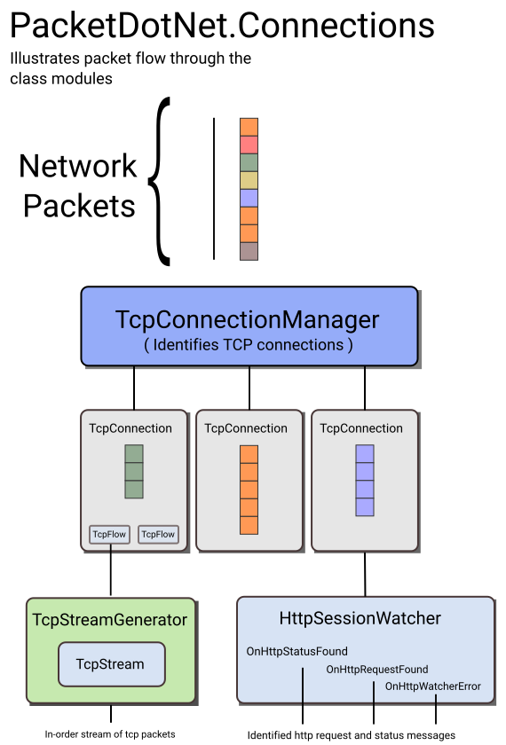

[](https://www.nuget.org/packages/packetnet-connections/)
[](https://ci.appveyor.com/project/chmorgan/packetnet-connections/branch/master)

# PacketDotNet.Connections

A supplementary library to [Packet.Net](http://github.com/chmorgan/packetnet) that provides classes to track
and follow connections.

Connection following is supported for tcp connections but it should be straightfoward to add support for
udp connections.

# Background

This library was developed for a commercial product to work with [SharpPcap](http://github.com/chmorgan/sharppcap) and Packet.Net to enable
the processing of TCP data streams. Several people have asked about this kind of functionality in Packet.Net for some
time and I wanted to Open Source it so others could make use of and learn from its implementation. This library should
be a good foundation to build from and improve for people looking to implement connection oriented processing.

# System diagram



# Licensing

The license is GPLv3. If you are interested in licensing for commercial use please contact me at chmorgan@gmail.com.

# Examples

See the Examples folder for a few examples such as:

## BandwidthMonitor
Tracks tcp connections and accumulates the data sent/received.

## ConnectionsExample
Tracks tcp connections and shows when connections are created and shut down.


## HttpMonitorExample
Decodes http traffic sent through tcp connections and displays the http content.
With the almost universal use of https this example may not be as useful as it would have been a few years ago.

# Unit tests

Located in the UnitTest directory. Written in xUnit as xUnit is bundled with .NET.

Build and run either through VisualStudio or on the command line from the output directory like:

```
dotnet vstest UnitTest.dll
```

Output looks like:

```
$ dotnet vstest UnitTest.dll
Microsoft (R) Test Execution Command Line Tool Version 15.9.0
Copyright (c) Microsoft Corporation.  All rights reserved.

Starting test execution, please wait...
tcpPacket.PayloadData.Length 0
HandleConnectionManagerOnConnectionFound c [TcpConnection: HasTimedOut=False, Flow[0] [TcpFlow address 192.168.1.4, port 37427], Flow[1] [TcpFlow address 24.249.30.92, port 2222]]
Connection found: 192.168.1.64:38734 <-> 157.166.224.26:80
0 bytes in stream
measurement: 192.168.1.64:38734 <-> 157.166.224.26:80 - [ConnectionTimes synTime '1299375314.196014s', synAckTime '1299375314.377115s', elapsed '00:00:00.1811010']
Connection found: 192.168.1.64:43853 <-> 157.166.255.216:80
measurement: 192.168.1.64:43853 <-> 157.166.255.216:80 - [ConnectionTimes synTime '1299375314.463864s', synAckTime '1299375314.680644s', elapsed '00:00:00.2167800']
Connection found: 192.168.1.64:60904 <-> 157.166.255.19:80
...
```
